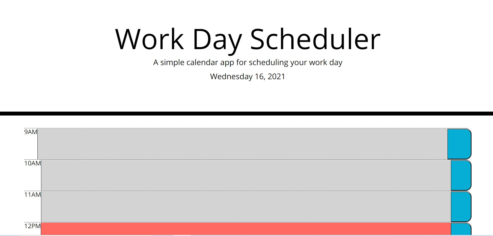

## Title
Work Day Scheduler

## Description/User Story
The user requested that an applicaiton would be so that they could make a schedule for their workday. The schedule has normal buisness hours and allows users to enter different events as they please. The timeblocks are color coded with gray representing past events, green representing future events, and red representing current events.

## Assignment Tasks
1. When I open the calendar
   Then I see the date at the top of the calendar
2. When I scroll down
   Then I am presented with timeblocks for regular buisness hours
3. When I view the time blocks for that  day
   Then each timeblock is color coded to indicate if it is in the past, future, or present
4. When I click into a time block
   Then I can enter an event
5. When I click the save button for that time block
   Then the text for that event is saved in local storage
6. When I refresh the page
   The saved event persists 

## Technologies Used
The technologies I used were HTML, CSS, Javascript, Bootstrap, and JQUERY

## Link to Application
<a href="https://joker282855.github.io/Calendar/">Application Link</a>

## Screenshot
